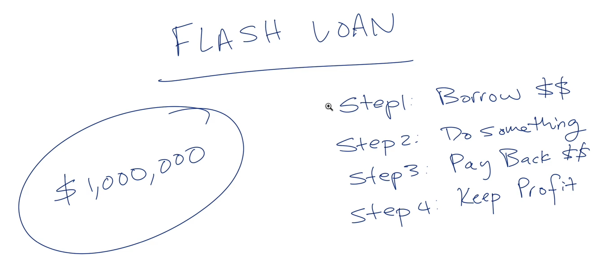
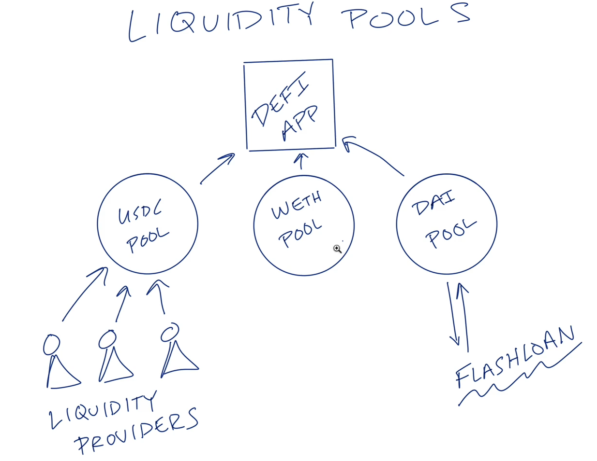
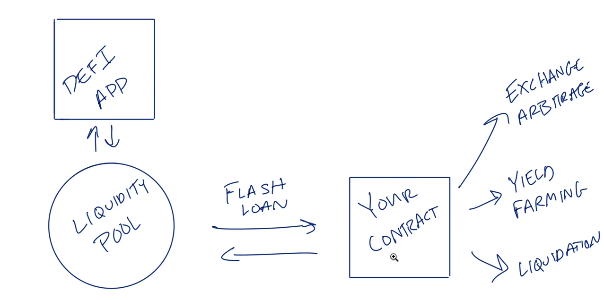
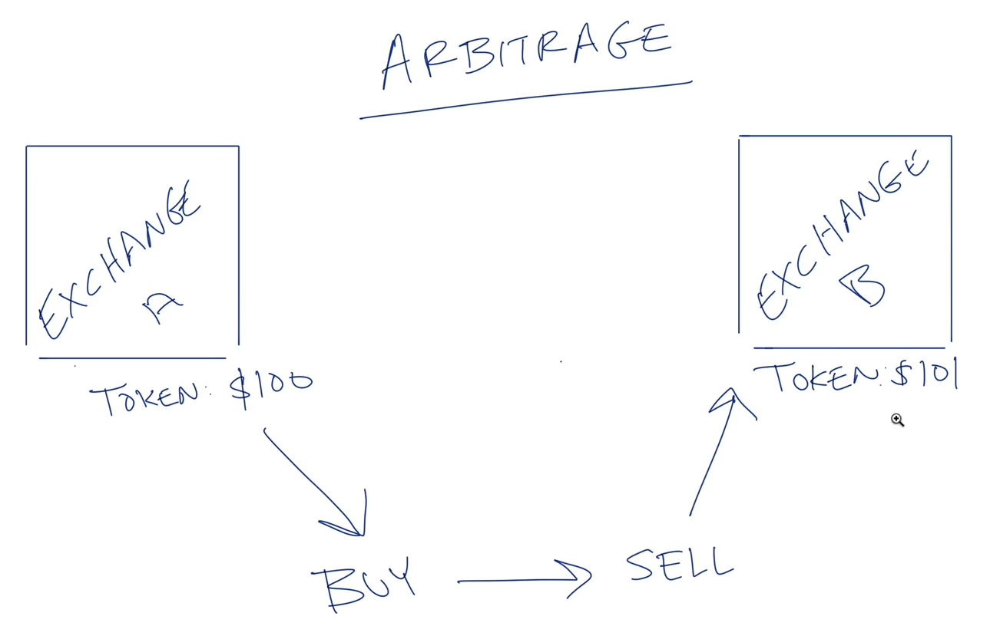

# Flash loans
- Borrow money in a instant
- You have to pay the money back instantanly
- There is no colateral, because it makes some kind of simulation at the time you invoke the flash loan and if it does not return the money borrowed, it does not run at all

- case it somehow fails in some of these steps, it simply does not do any kind of operation because the smart contract is running in the EVM and verifies it (state machine)
- Also, you should note that if you are sucessfull you will pay a fee discounted from the profit you just did
- Flash loans come from a defi app liquidity pools

- This is a liquidity pool, which is used to make swaps easier by retaining it inside a given pool
- The people that gives their tokens to this pools, receives yield from the trading fees 
- This is some kind of backend because it is powered by smart contracts

- An normal strategies is to take out the flash loan and instantly do some kind of operation as for example: exchange arbitrage (buying one token in a defi and sell it in another because they differ in price and you earn by founding this difference); Yield farming (borrowing the money and receiving platform yields instantly) and Liquidation (receiving rewards for making some source of liquidation on the platform). You should note that since we have the flash loan, we are increasing our  position and making the gains more significant
 